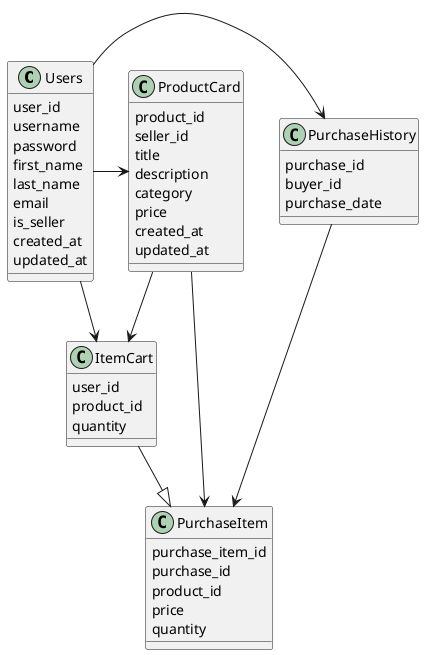

# Компонентная архитектура
<!-- Состав и взаимосвязи компонентов системы между собой и внешними системами с указанием протоколов, ключевые технологии, используемые для реализации компонентов.
Диаграмма контейнеров C4 и текстовое описание. 
-->
## Компонентная диаграмма

```plantuml
@startuml
!include https://raw.githubusercontent.com/plantuml-stdlib/C4-PlantUML/master/C4_Container.puml

AddElementTag("microService", $shape=EightSidedShape(), $bgColor="CornflowerBlue", $fontColor="white", $legendText="microservice")
AddElementTag("storage", $shape=RoundedBoxShape(), $bgColor="lightSkyBlue", $fontColor="white")

Person(seller, "Продавец", "Реализует собственную продукцию на платформе")
Person(buyer, "Покупатель", "Покупает желаемый товар у любого из продавцов")

System_Ext(web_site, "Клиентский веб-сайт", "HTML, CSS, JavaScript, React", "Веб-интерфейс")

Rel(seller, web_site, "Добавление карточки товара, изменение информации о товаре, удаление товара")
Rel(buyer, web_site, "Просмотр карточек товаров, поиск товаров по маске названия, добавление товара в корзину, покупка товара")


System_Boundary(conference_site, "Маркетплейс") {
  '  Container(web_site, "Клиентский веб-сайт", ")
   Container(auth_service, "Сервис авторизации", "Python", "Сервис управления пользователями", $tags = "microService")    
   Container(item_service, "Сервис управления карточкой товара", "Python", "Создания карточки товара продавцом", $tags = "microService") 
   Container(suggestion_service, "Сервис просмотра карточек товаров", "Python", "Создание ленты товаров для пользователя, подсказка с помощью рекомендаций", $tags = "microService")
   Container(recsys_service, "Сервис покупки товаров", "Python", "Взаимодействие с корзиной пользователей и осуществление покупки товара", $tags = "microService")
   ContainerDb(db, "База данных", "MariaDB", "Хранение данных о товарах, продавцах и пользователях", $tags = "storage")
   
}

Rel(web_site, auth_service, "Авторизация покупателя/продавца", "localhost/auth")
Rel(auth_service, db, "INSERT/SELECT/UPDATE", "SQL")

Rel(web_site, item_service, "Работа с карточкой товара продавцом", "localhost/construct_item")
Rel(item_service, db, "INSERT/SELECT/UPDATE", "SQL")

Rel(web_site, recsys_service, "Работа рекомендательной системы", "localhost/recommend")
Rel(recsys_service, db, "INSERT/SELECT/UPDATE", "SQL")

Rel(web_site, suggestion_service, "Работа с блогами", "localhost/main")
Rel(suggestion_service, db, "INSERT/SELECT/UPDATE", "SQL")

@enduml
```
## Список компонентов  

### Сервис авторизации
**API**:
-	Создание нового пользователя
      - входные параметры: login, пароль, имя, фамилия, email, статус(продавец/покупатель)
      - выходные параметры: сообщение о статусе операции, логин
-	Поиск пользователя по логину
     - входные параметры:  login
     - выходные параметры: имя, фамилия, email, обращение (г-н/г-жа)
-	Поиск пользователя по маске имени и/или фамилии
     - входные параметры: маска фамилии, маска имени
     - выходные параметры: список всех атрибутов всех найденных по маске пользователей

### Сервис управления карточкой товара
**API**:
- Создание карточки товара
  - Входные параметры: название товара, описание товара, категория товара, цена, login создателя товара
  - Выходыне параметры: сообщенеи о статусе операции, class user, dict созданного товара
- Проверка уникальности товара у продавца по заголовку
  - Входные параметры: user_id, card_title
  - Выходыне параметры: bool
- Изменение карточки товара:
  - Входные параметры: логин пользователя, id товара, название товара, опционально описание товара, категория товара, цена товара
  - Выходные параметры: сообщение о статусе операции, обновленная карточка товара (dict), class user
- Удаление товара:
  - Входные параметры: id карточки товара, логин пользователя
  - Выходные параметры: сообщение о статусе операции, удаленная карточка товара (dict), class user

### Сервис просмотра карточек товаров
**API**
- Поиск карточки товара
  - Входные параметры: id карточки товара
  - Выходные параметры: карточка товара (dict)
- Получение списка товаров для стартовой страницы:
  - Входные данные: нет
  - Выходные данные: список всех карточек товаров из каталога
- Получение 10 рекомендуемых товаров для пользователя
  - Входные данные: логин пользователя
  - Выходные данные: список из 10 рекомендуемых карточек товаров

### Сервис покупки товаров
**API**:
- Добавление товара в корзины
  - Входные параметры: id пользователя, id товара, кол-во товара к добавлению
  - Выходные параметры: сообщение о статусе операции, карточка товара (dict)
- Удаление товара из корзины
  - Входные параметры: id пользователя, id товара
  - Выходные параметры: сообщение о статусе операции, id пользователя, удаленная карточка товара (dict)
- Удаление корзины
  - Входные параметры: id пользователя
  - Выходные параметры: сообщение о статусе операции, id пользователя, удаленная корзина товаров (List[dict])
- Добавление 1 шт. товара в созданной корзине
  - Входные параметры: id пользователя, id товара
  - Выходные параметры: сообщение о статусе операции, id пользователя, id товара, карточка товара (dict)
- Получение продуктовой корзины пользователя
  - Входные параметры: id пользователя
  - Выходные параметры: id пользователя, id товара, список карточек товара из продуктовой корзины (List[dict])
- Покупка товара
  - Действие: создает запись о покупке пользователем; перекладывает товары из продуктовой корзины в таблицу с детализацией покупок; удаляет продуктовую корзину из таблицы с корзинами
  - Входные параметры: id пользователя
  - Выходные параметры:  сообщение о статусе операции, user_id, user_cart

### Модель данных
